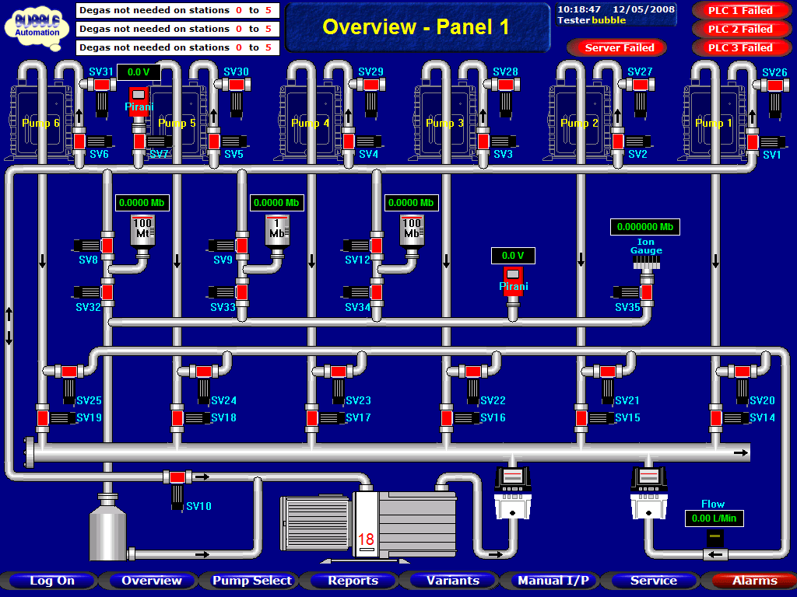

Working in the Industrial Control Systems for a number of years, I have always wondered what can be done
about my lack of creativity when creating a user experience for SCADA operators and users. Screens I
typically create are be based on the SCADA's graphics library, may or may not be predominantly grey
and generally lack creativity.

Having a background in electrical engineering and being thrown into the deep end by being asked to create
graphics without training, it's really no surprise that they would turn out this way. I mean who really 
has the time (And more importantly, the skill) to create attractive custom graphics. 

This is what I want to change.

<!--truncate-->

I'm certainly not the first to think about this and in fact there are a number of guidelines that begin 
to address this. ANSI/ISA101 and the ASM Consortium guidelines are the two I've heard of. I'd expect that
they provide best practise guidelines for creating effective SCADA systems. 

Looking to download them, anyone in the industry will not be surprised they are not free.
- [ISA101 Purchase Page](https://www.isa.org/products/ansi-isa-101-01-2015-human-machine-interfaces-for)
- [ASM Consortium Landing Page](https://process.honeywell.com/us/en/site/asm-consortium/join-asm-consortium)

*While just guidelines, they probably shouldn't be used as a substitute for formal training anyway.*

No problem. 

Let's take a look at what free resources are available to learn from, you'll find a number of summaries
all very similar. Taking a look at one such, [Engineering Institute of Technology Webinar](https://www.eit.edu.au/wp-content/uploads/2022/01/2022.01.20_SCADA_ASM_v3_WithRecording.pdf),
offers a brief overview of abnormal situation management based SCADA design with the main points being.
- Navigation
- Display Styles
- Display Layout
- Use of Colour
- Use of Symbols
- Text Legibility
- User Interactions
- Alarming and Notifications

People from outside the industrial controls industry may recognize these topics as a subset of what 
functions a user experience (UX) designer would perform. And reviewing some topics covered in UX design 
articles most, if not all, of the design principles apply directly to SCADA design.

Taking a look at the background required for UX designer jobs, they have a couple of common requirements:-
- Bachelor's Degree in Design, Graphic Design, Human-Computer Interaction, or related field.
- Portfolio of work that showcases design process and thinking
- Proficient with industry-standard interaction and visual design programs such as Sketch, FIGMA, etc.

This tells me that you'd generally expect a UX designer to have a graphic design background, instead of
the industrial controls default of some engineering degree. This is probably one of the most important 
points that highlight why most SCADA graphics don't have that professional look and feel. I'm not saying
that all SCADA graphics should be animated masterpieces, but the basic UX principles should still apply.

However, as hiring a designer would limit my marketability, I don't support it :wink:

There does seem to be plenty of courses available to help fill my gap in knowledge though:-
- [Google UX Design Certificate](https://grow.google/certificates/ux-design/#?modal_active=none)
- [edX UX Design](https://www.edx.org/course/ux-design)
- [Coursea UI UX Design](https://www.coursera.org/specializations/ui-ux-design)

Additionally, taking a look at one of the prototyping packages I've never heard of, FIGMA.

The interface looks very familiar with similar functionality to the majority of SCADA packages. There are some
cool features that could be used within the industry.
- It is an online platform, so collaborating with other engineers/designers or even the client becomes trivial.
It opens the design process to fast design iterations.
- You're able to export the pages to SVG, while you probably don't want to directly import everything into
your SCADA system, there is the  possibility to import select items.
- You can mimic the page navigation/popups flows via the prototype step.

All in all, hiring UX designers for SCADA design probably isn't going to be common place any time soon. However,
there is definitely crossover between the two roles and plenty to learn from the broader UX design space.

*[SCADA graphic provided by Green Mamba from Flickr](https://www.flickr.com/photos/greenmambagreenmamba/5233622599/)*
